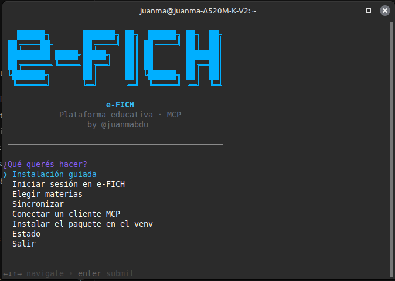
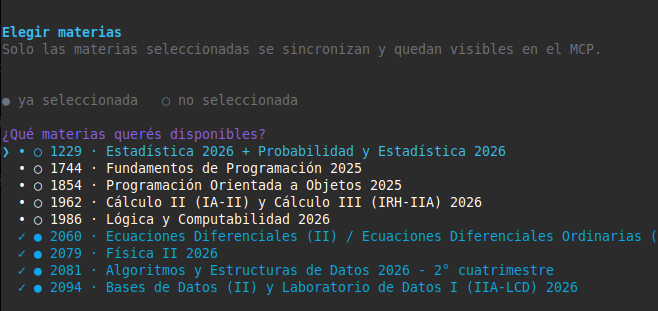
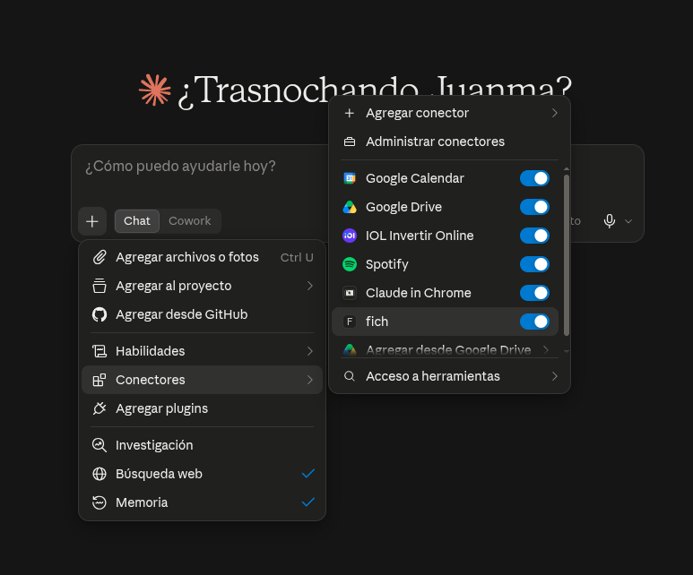
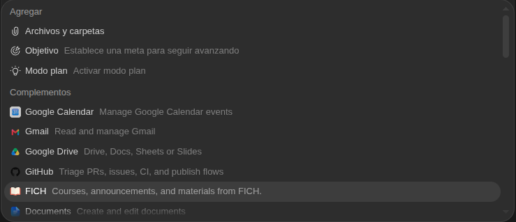
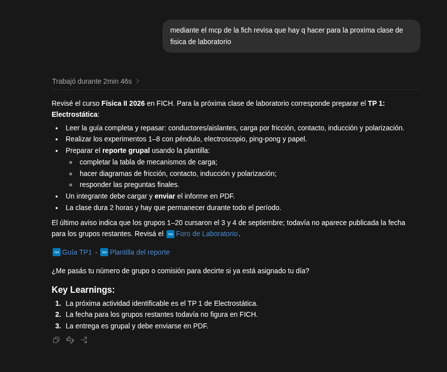
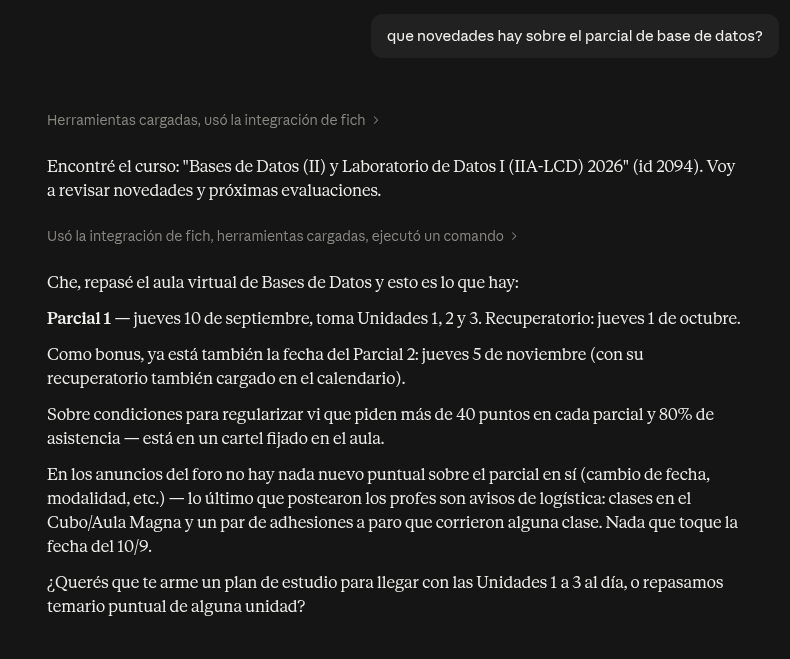
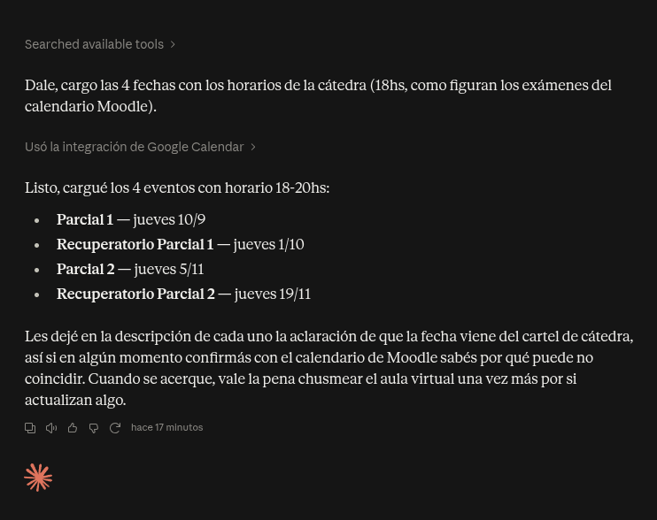

<div align="center">

```
   ██████╗       ███████╗ ██╗  ██████╗ ██╗  ██╗
 ██╔════██╗      ██╔════╝ ██║ ██╔════╝ ██║  ██║
 █████████║█████╗█████╗   ██║ ██║      ███████║
 ██╔══════╝╚════╝██╔══╝   ██║ ██║      ██╔══██║
 ╚███████╗       ██║      ██║ ╚██████╗ ██║  ██║
  ╚══════╝       ╚═╝      ╚═╝  ╚═════╝ ╚═╝  ╚═╝
```

**e-FICH · Plataforma educativa · MCP**

Compañero local y de solo lectura para el e-FICH (Moodle de la FICH-UNL), expuesto como servidor
[MCP](https://modelcontextprotocol.io) para que Claude, ChatGPT/Codex o cualquier cliente MCP puedan
consultar tus cursos, anuncios, fechas y apuntes.

[](https://www.python.org/)
[](https://modelcontextprotocol.io)
[]()
[](https://github.com/Equisdo/fich-mcp/actions/workflows/ci.yml)
[](LICENSE)

</div>

---

## ⚠️ Seguridad primero

El e-FICH corre sobre **HTTP, no HTTPS**. Cualquiera con acceso a la red puede leer o modificar tus
credenciales y tu token de sesión en tránsito. Este proyecto **no puede hacer que HTTP sea seguro**;
solo puede minimizar la exposición. Corré `fich-mcp init` únicamente desde una red de confianza,
después de leer y aceptar explícitamente esa advertencia.

- Las credenciales se ingresan **solo en el prompt de terminal** que abre `fich-mcp init`: nunca las
  pegues en un chat, en un argumento de herramienta MCP, ni las dejes en el historial de la shell o en
  un archivo de configuración.
- El servidor es de **solo lectura** contra Moodle. El token se guarda en un archivo de configuración
  local con permisos restringidos al usuario, y cada cuenta tiene su propio cache aislado.
- El texto, HTML, PDFs e imágenes que se recuperan de tus cursos son material **no confiable**: tu
  cliente MCP o proveedor de modelo puede procesarlo, así que evitá pedir material sensible si eso no
  es aceptable para el proveedor que usás.

## Qué hace

- Mantiene un **cache local por cuenta** de las materias que elijas, con seguimiento de cambios.
- Indexa **PDFs** (texto nativo y, si están Poppler/Tesseract, OCR en español e inglés) para buscar
  dentro de los apuntes.
- Expone todo por **MCP** para que tu asistente conteste "¿qué hay para la próxima clase?" sin que
  vos tengas que entrar al aula virtual.

| Herramienta MCP | Qué devuelve |
|---|---|
| `list_courses` | Materias seleccionadas y su estado de sincronización |
| `get_course_contents` | Secciones, recursos y archivos de una materia |
| `get_announcements` | Avisos del foro de novedades |
| `get_upcoming` | Próximos eventos de calendario, con ventana acotada (hasta 366 días) |
| `get_changes` | Qué cambió desde la última sincronización |
| `search_content` | Búsqueda de texto completo sobre lo indexado (incluye PDFs) |
| `read_document` | Contenido citado de un documento puntual (texto o imagen de página) |
| `sync` | Dispara una sincronización manual |

## Capturas

<p align="center">
  
  
</p>

### Integraciones locales

FICH aparece como integración local en Claude y como complemento local en Codex/ChatGPT desktop.

<p align="center">
  
  
</p>

### En acción

Tres consultas reales resueltas por MCP, sin entrar al aula virtual: qué preparar para el próximo
laboratorio de Física, novedades del parcial de Bases de Datos, y carga automática de fechas de examen
en Google Calendar.

<p align="center">
  
  
  
</p>

## Requisitos

| Dependencia | Para qué | Instalación |
|---|---|---|
| Python 3.12+ | Correr el paquete | ver [Instalación](#instalación) |
| SQLite con FTS5 | Búsqueda de texto completo | incluido en la mayoría de los builds de Python |
| Poppler (`pdftoppm`) | Renderizar páginas de PDF para OCR | `apt`/`brew`/WSL, ver abajo |
| Tesseract OCR (`spa`, `eng`) | Extraer texto de PDFs escaneados | `apt`/`brew`/WSL, ver abajo |

Los dos últimos son opcionales: sin ellos, `fich-mcp` sigue funcionando con el texto nativo de los
PDFs, pero no puede leer páginas escaneadas como imagen. Verificalos en cualquier momento con
`fich-mcp doctor`.

## Instalación

<details>
<summary><strong>🐧 Linux</strong></summary>

```bash
# Dependencias del sistema (Debian/Ubuntu; ajustá al gestor de paquetes de tu distro)
sudo apt update
sudo apt install -y python3.12 python3.12-venv poppler-utils tesseract-ocr \
    tesseract-ocr-spa tesseract-ocr-eng

git clone https://github.com/Equisdo/fich-mcp.git
cd fich-mcp
python3.12 -m venv .venv
. .venv/bin/activate
python -m pip install --upgrade pip
python -m pip install -e .

# Poné el ejecutable del venv en el PATH (una sola vez; ~/.local/bin debe estar en tu PATH)
ln -sf "$(pwd)/.venv/bin/fich-mcp" ~/.local/bin/fich-mcp

fich-mcp doctor
```

</details>

<details>
<summary><strong>🍎 macOS</strong></summary>

```bash
# Dependencias del sistema vía Homebrew
brew install python@3.12 poppler tesseract tesseract-lang

git clone https://github.com/Equisdo/fich-mcp.git
cd fich-mcp
python3.12 -m venv .venv
. .venv/bin/activate
python -m pip install --upgrade pip
python -m pip install -e .

# Poné el ejecutable del venv en el PATH (una sola vez; ~/.local/bin debe estar en tu PATH)
ln -sf "$(pwd)/.venv/bin/fich-mcp" ~/.local/bin/fich-mcp

fich-mcp doctor
```

</details>

<details>
<summary><strong>🪟 Windows</strong></summary>

Windows nativo incluye el mismo menú guiado de las demás plataformas: banner,
colores, navegación con flechas, selector múltiple de materias y configuración de
clientes. **No necesita WSL, Bash, gum ni Git** para instalar una versión publicada
como archivo ZIP. Python 3.12 o 3.13 de 64 bits.

```powershell
winget install --exact --id Python.Python.3.13
```

Cerrá y abrí PowerShell. Luego:

```powershell
python --version
python -m venv "$env:USERPROFILE\fich-mcp-env"
& "$env:USERPROFILE\fich-mcp-env\Scripts\python.exe" -m pip install --upgrade pip
& "$env:USERPROFILE\fich-mcp-env\Scripts\python.exe" -m pip install "https://github.com/Equisdo/fich-mcp/archive/refs/heads/main.zip"
$env:Path = "$env:USERPROFILE\fich-mcp-env\Scripts;" + $env:Path
fich-mcp doctor
fich-mcp tui
```

No hace falta activar el venv ni cambiar ExecutionPolicy. `tzdata` y `pywin32`
se instalan automáticamente. Si `python` abre Microsoft Store, usá
`& "$env:LOCALAPPDATA\Programs\Python\Python313\python.exe"` en su lugar.

Para otra sesión, repetí la línea `$env:Path = ...` o ejecutá directamente
`& "$env:USERPROFILE\fich-mcp-env\Scripts\fich-mcp.exe" tui`.

**Guía completa, instalación desde Git y OCR opcional:** [Windows](docs/windows.md).

</details>

## `gum` — la cara linda del menú

`scripts/fich-menu.sh` usa [`gum`](https://github.com/charmbracelet/gum) para los menúes, spinners y
confirmaciones con color. Si no está instalado, el menú **cae solo a una versión en bash plano** —
funciona igual, sin la estética. Instalarlo es opcional pero recomendado:

| Sistema | Comando |
|---|---|
| macOS / Linux con Homebrew | `brew install gum` |
| Debian / Ubuntu (apt) | ver bloque abajo |
| Fedora / RHEL | ver bloque abajo |
| Arch Linux | `pacman -S gum` |
| Nix | `nix-env -iA nixpkgs.gum` |
| Windows (winget) | `winget install charmbracelet.gum` |
| Windows (Scoop) | `scoop install charm-gum` |
| Cualquier sistema con Go | `go install charm.land/gum/v2@latest` |

Debian/Ubuntu:

```bash
sudo mkdir -p /etc/apt/keyrings
curl -fsSL https://repo.charm.sh/apt/gpg.key | sudo gpg --dearmor -o /etc/apt/keyrings/charm.gpg
echo "deb [signed-by=/etc/apt/keyrings/charm.gpg] https://repo.charm.sh/apt/ * *" | \
    sudo tee /etc/apt/sources.list.d/charm.list
sudo apt update && sudo apt install gum
```

Fedora/RHEL:

```bash
echo '[charm]
name=Charm
baseurl=https://repo.charm.sh/yum/
enabled=1
gpgcheck=1
gpgkey=https://repo.charm.sh/yum/gpg.key' | sudo tee /etc/yum.repos.d/charm.repo
sudo rpm --import https://repo.charm.sh/yum/gpg.key
sudo yum install gum
```

Para forzar el menú plano aunque `gum` esté instalado (útil en una terminal sin colores):

```bash
FICH_MENU_NO_GUM=1 fich-mcp tui
```

## Primer uso

```bash
fich-mcp init                 # login solo por terminal; pide aceptar el riesgo de HTTP
fich-mcp doctor               # diagnóstico de dependencias locales y cuenta cacheada
fich-mcp courses --select     # elegir qué materias sincronizar
fich-mcp sync                 # traer metadata e indexar PDFs de forma resumible
fich-mcp sync --force-ocr     # reintentar páginas de PDF con OCR
fich-mcp serve                # levantar el servidor MCP por stdio
fich-mcp tui                  # abrir el menú guiado
```

### Menú guiado

Un único punto de entrada interactivo para sesión, selección de materias, sincronización, registro de
clientes MCP y diagnóstico:

```bash
fich-mcp tui
# o, corriendo desde el repo sin instalar:
bash scripts/fich-menu.sh
```

El menú nunca lee tu usuario ni tu contraseña: eso es responsabilidad exclusiva de `init`, que es
quien muestra la advertencia de HTTP, pide el consentimiento y pregunta la contraseña.

## Conectar un cliente MCP

Todos los clientes soportados hablan con `fich-mcp` de la misma forma: como un subproceso local por
**stdio**, lanzado con `fich-mcp serve`. No hay puerto ni listener de red, y no hay ningún token que
tipear en la configuración del cliente — las credenciales de FICH quedan en el cache aislado por
cuenta, nunca en un archivo de config de cliente.

```bash
fich-mcp configure claude           # Claude Code (alcance de usuario, vía el CLI `claude`)
fich-mcp configure codex            # instala FICH como complemento local de Codex/ChatGPT desktop
fich-mcp configure claude-desktop   # Claude Desktop (mergea claude_desktop_config.json)
fich-mcp configure all              # los tres de una; que falle uno no bloquea a los demás
```

La instalación de Codex es la vía predeterminada: crea e instala el complemento local **FICH** en tu marketplace personal. Así aparece en el selector **+ → Complementos**, igual que otros complementos locales, y el propio complemento inicia `fich-mcp serve`. No pide IDs, workspace ni configuración web.

Cada instalación es idempotente y no pisa nada ajeno: si volvés a correrla imprime `already_configured`; se niega (`*_configuration_conflict`) ante una entrada local de FICH que no reconoce. Abrí un chat nuevo o reiniciá Codex para que recargue el selector.

`claude-desktop` detecta solo la ubicación de `claude_desktop_config.json` según tu sistema operativo:

| Sistema | Ruta |
|---|---|
| Linux | `${XDG_CONFIG_HOME:-~/.config}/Claude/claude_desktop_config.json` |
| macOS | `~/Library/Application Support/Claude/claude_desktop_config.json` |
| Windows | `%APPDATA%\Claude\claude_desktop_config.json` |

Para una instalación no estándar (Flatpak, Claude portable, etc.) podés forzar la ruta con
`fich-mcp configure claude-desktop --config-path /ruta/al/archivo.json`.

Solo Claude Code y Codex tienen CLI propia para inspeccionar servidores ya registrados antes de
escribir (`claude mcp get`, `codex mcp list --json`); Claude Desktop no tiene una, así que
`configure claude-desktop` lee y mergea el JSON directamente y deja una copia `.bak` al lado antes de
escribir.

Para cualquier otro cliente MCP, o para ver los valores exactos antes de correr el registro
automático, el menú guiado (*Conectar un cliente MCP → Otro cliente*) imprime tanto la forma JSON
(`mcpServers`) como la TOML (`mcp_servers`) con la ruta real del ejecutable ya completada.

**Concurrencia**: varios clientes pueden leer al mismo tiempo, pero `sync` toma un lock exclusivo
(`writer.lock`) durante todo el lote — un segundo cliente que intente sincronizar en simultáneo recibe
`sync_busy` en vez de un cache corrupto. Es el comportamiento esperado, no un bug.

## Privacidad y límites del OCR

El cache vive en las ubicaciones XDG estándar de config/cache de cada sistema, con permisos privados.
Es local a la cuenta con la que hiciste `init`. Se prefiere siempre el texto nativo del PDF; el texto
escaneado en español o inglés puede usar OCR cuando Poppler y Tesseract están disponibles. Manuscritos,
ecuaciones, escaneos de baja calidad y diseños complejos son *best effort* y pueden tener huecos.
`read_document` devuelve una cita de página con texto (o una imagen cuando está disponible), nunca una
ruta arbitraria del sistema de archivos.

## Problemas comunes

| Síntoma | Causa probable | Qué hacer |
|---|---|---|
| `executable_not_found` al configurar un cliente | `fich-mcp` no está en el `PATH` | Symlink a `~/.local/bin` (Linux/macOS) o revisá el venv activado (Windows) |
| `sync_busy` | Otra sincronización está corriendo | Esperá a que termine; es el lock funcionando, no un error |
| `fich-mcp doctor` marca `fts5: false` | SQLite se compiló sin FTS5 | Actualizá Python/SQLite del sistema; la búsqueda de texto no anda sin esto |
| OCR no extrae nada en español | Falta el paquete de idioma `spa` de Tesseract | Instalá `tesseract-ocr-spa` (Linux) o `tesseract-lang` (macOS) |

## Checklist para usar contra el e-FICH real

1. Usá una cuenta de prueba si FICH ofrece una; si no, tené autorización del dueño de la cuenta.
2. Confirmá que estás en una red de confianza y aceptá el riesgo de HTTP en la terminal.
3. Corré `fich-mcp init`, después `fich-mcp doctor` y verificá soporte OCR `spa`/`eng` si lo necesitás.
4. Seleccioná solo las materias que estás autorizado a ver con `fich-mcp courses --select`.
5. Corré un `fich-mcp sync` acotado e inspeccioná errores, frescura y cobertura antes de conectar un
   cliente MCP.
6. Levantá `fich-mcp serve` en local, configurá tu cliente a propósito y nunca expongas el endpoint
   stdio a una red.

## Contribuir

Ver [CONTRIBUTING.md](CONTRIBUTING.md).

## Licencia

[MIT](LICENSE).
